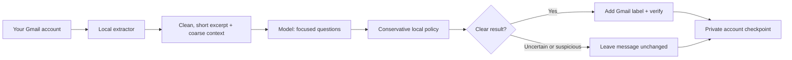

# Inbox Triage

[](https://github.com/shimoverse/inbox-triage/actions/workflows/ci.yml)

**An email sorting assistant that keeps you in control.** Inbox Triage reads new Gmail messages, asks a language model a few focused yes/no questions, and adds useful Gmail labels. It does **not** archive, send, delete, mark read, or move messages to Spam. Uncertain mail stays where it is. Each account runs independently on your own machine, with your own Google credentials.

## What it feels like

1. **Connect your Gmail accounts** on your own computer. OAuth tokens stay there.
2. **Preview first** with `--dry-run`. You see aggregate counts, not your private message text.
3. **Turn on labels** when you're comfortable. Look for `Triage/Needs You`, `Triage/Updates`, `Triage/For You`, `Triage/Later`, and `Topics/Shopping` in Gmail. A message can get one attention label and a Shopping label. Otherwise it stays unchanged.
4. **Schedule it.** Each run resumes from a private checkpoint, skips messages it already verified, and reads back every label change.



The model is only asked questions. It never decides what happens to mail. The local rules in [`policy.py`](src/inbox_triage/policy.py) do that, so a manipulative email ("ignore previous instructions…") can at worst avoid getting a label.

## Choose a classifier

| `--provider` | Where mail excerpts go | Setup |
|---|---|---|
| `openai` | Any OpenAI-compatible endpoint. The default is a **local [Ollama](https://ollama.com)** server (`http://localhost:11434/v1`), so nothing leaves your machine. | `ollama pull llama3.1:8b`, then `--model llama3.1:8b`. Set `OPENAI_BASE_URL` / `OPENAI_API_KEY` to use a hosted endpoint. |
| `anthropic` | Claude via the Anthropic API | `uv sync --extra anthropic`, then set `ANTHROPIC_API_KEY`. Default model `claude-opus-5`; override with `--model`. |
| `jev` (default) | [Jev](https://typesafe.ai/) by typesafe.ai | Set `TYPESAFE_API_KEY`. |
| `rules` | Nowhere: no model, fully offline | Nothing. It uses Gmail's own categories and headers, and labels only obvious bulk mail. Good for a first trial. |

Every provider gets the same trimmed input: the sender domain, a subject of up to 200 characters, a cleaned excerpt of up to 1,000 characters, and coarse context flags. It never gets message IDs, addresses, full MIME, attachments, earlier mail, or your OAuth token. You can set a default with `INBOX_TRIAGE_PROVIDER` and `INBOX_TRIAGE_MODEL`.

## Get started

Requirements: Python 3.11+ and [uv](https://docs.astral.sh/uv/).

### 1. Google Cloud setup (once, about 10 minutes)

Each user brings their own Google OAuth client. This keeps your mailbox between you and Google, and it avoids Google's paid security review, which a shared "restricted scope" app would need.

1. In the [Google Cloud console](https://console.cloud.google.com/), create a project and **enable the Gmail API**.
2. Configure the **OAuth consent screen**: choose User type *External* (or *Internal* on Google Workspace) and add your addresses as test users.
3. **Important:** while the app's publishing status is *Testing*, Google [expires refresh tokens after 7 days](https://developers.google.com/identity/protocols/oauth2#expiration), and scheduled runs start failing. For unattended use, click **Publish app**. For personal use (fewer than 100 users), you can [skip verification](https://support.google.com/cloud/answer/13464323) and accept the "unverified app" warning during consent.
4. Create **Credentials → OAuth client ID → Desktop app**. Download the JSON to `~/.config/inbox-triage/client_secret.json`. Keep it outside this repository.

The app requests only `gmail.modify`, the narrowest Gmail scope that allows adding labels to messages. It never calls the send, delete, archive, or mark-read endpoints.

### 2. Connect accounts and run

```bash
git clone https://github.com/shimoverse/inbox-triage.git
cd inbox-triage
uv sync                                  # add --extra anthropic for Claude

# Browser consent happens locally. Repeat for each account; tokens are saved to
# ~/.config/inbox-triage/tokens/<email>.json (use --no-browser over SSH).
uv run inbox-triage-auth

# Preview: classifies but changes nothing in Gmail.
uv run inbox-triage --account you@example.com --provider rules --dry-run --max 5

# Label for real, one account or every connected account.
uv run inbox-triage --account you@example.com --provider openai --model llama3.1:8b
uv run inbox-triage --all --provider anthropic
```

The program checks that `--account` matches the mailbox the token belongs to before it processes anything. Keep tokens and API keys out of shared folders and shell history; prefer a secret manager or a private service environment over typing `export KEY=...`.

### 3. Schedule it

This repository does not install a background service. Use your OS scheduler, for example cron every 15 minutes:

```cron
*/15 * * * * cd ~/inbox-triage && ANTHROPIC_API_KEY=... uv run inbox-triage --all --provider anthropic >> ~/.local/state/inbox-triage.log 2>&1
```

Use launchd on macOS, or a systemd user timer on Linux. A per-account lock prevents overlapping runs, and one failing account does not stop the others. The exit code is non-zero if any account failed. Add `--verbose` to include error messages in the output.

## How it behaves

- A new account starts with **the last seven days** of received mail and processes up to **100 messages per account per run**. If that leaves a backlog, it won't advance its checkpoint until the scan is complete; just run it again. Later runs overlap by two days to catch delayed indexing and skip messages they already verified.
- Context comes from your mailbox. People you have emailed and threads you took part in count as known relationships. Authenticated (DMARC-pass) order and receipt senders count as recent purchases. It stores only account-scoped hashes of these facts, locally, and updates them incrementally through the Gmail History API. If Gmail's history window expires (roughly a week without a run), it rebuilds the context automatically.
- If the model returns an unusable answer, that message is retried on the next two runs and then left unchanged. Other mail keeps flowing. If the provider fails repeatedly, the run stops without advancing.
- Mail the model flags as possibly deceptive **never** gets an attention label.
- Optional priorities live in the account's private state folder as `priorities.json`, for example `{"priorities":[{"topic":"renewal","terms":["renewal"],"expires":"2027-01-01"}]}`. Only matching, unexpired topic names are sent to the model.

### Google Workspace: many mailboxes, one key

Workspace admins can triage many users without per-user consent, using a service account with [domain-wide delegation](https://developers.google.com/identity/protocols/oauth2/service-account#delegatingauthority):

1. Create a service account and a JSON key.
2. In the Admin console (Security → API controls → Domain-wide delegation), authorize its client ID for `https://www.googleapis.com/auth/gmail.modify`.
3. Run: `uv run inbox-triage --service-account key.json --account alice@corp.example --account bob@corp.example`

Delegation only works for Workspace domains, not consumer gmail.com accounts. Treat the key as highly sensitive: it can read every mailbox you delegate.

## Privacy and limits

- **Local files per account:** a checkpoint, a deduplication journal of Gmail message IDs and label decisions (compacted after 30 days), and a SQLite store of hashed relationship evidence. The default location is `~/.local/share/inbox-triage/`, one opaque directory per account, with 0700/0600 permissions. Raw messages are never saved. Exclude this directory from shared cloud sync and backups.
- Only received mail is considered; Sent, Drafts, Spam, and Trash are excluded. A message that is already read or archived can still be labeled, and labels never change its location or read status.
- Labels are created on the first live run, and only these five are managed. There is no automatic Spam routing, archiving, sending, deleting, unsubscribing, or learning from read state.
- This is a conservative aid, **not** a guaranteed detector of urgent mail. Don't rely on it as your only way to notice security, medical, financial, or time-sensitive messages. Quality varies by model, language, and mailbox.
- Gmail API quota: each labeled message costs about 65 [quota units](https://developers.google.com/workspace/gmail/api/reference/quota) (one full read, two label readbacks, one modify), and there is a one-time bootstrap of up to 500 metadata reads. The per-user limit is 6,000 units per minute. Reads are batched, and rate-limit responses are retried with backoff.

## Developers

```bash
uv sync --dev --extra anthropic
uv run pytest -q
uv run inbox-triage --help
```

| Module | Role |
|---|---|
| `gmail/client.py` | Gmail access: batching, retries, History API, OAuth token and service-account credentials |
| `gmail/extract.py` | MIME → cleaned excerpt plus authentication and bulk signals |
| `context.py`, `store.py` | Hashed relationship and purchase facts learned from Sent mail and history |
| `providers/` | `base.py` (questions and answer parsing), `jev.py`, `llm.py` (Claude, OpenAI-compatible), `rules.py` |
| `policy.py` | Signals → at most one attention label and a topic label |
| `runner.py` | Per-account scheduling, locking, journal, label apply and readback, CLI |

See [CONTRIBUTING.md](CONTRIBUTING.md), [SECURITY.md](SECURITY.md), and [docs/landscape.md](docs/landscape.md) for related projects and the roadmap. Use synthetic messages in tests, never real email exports.

MIT license.
