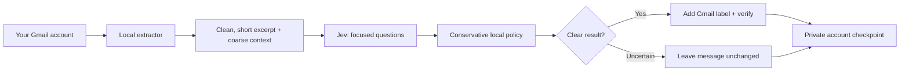

# Inbox Triage

**An email sorting assistant that keeps you in control.** Inbox Triage reads new Gmail messages, asks [Jev](https://typesafe.ai/) a few focused questions, and adds useful Gmail labels. It does **not** archive, send, delete, mark read, or move messages to Spam. Uncertain mail stays where it is. Each account runs independently; no frontier-model agent is needed for routine sorting.

## What it feels like

1. **Connect your Gmail account** on your own computer. The OAuth token stays there.
2. **Preview first** with `--dry-run`. See aggregate counts, not your private message text.
3. **Turn on labels** when you're comfortable. Find `Triage/Needs You`, `Triage/Updates`, `Triage/For You`, `Triage/Later`, and `Topics/Shopping` in Gmail. A message can have an attention label and a Shopping label; otherwise it stays unchanged.
4. **Run it again** from your scheduler. It resumes from a private checkpoint, skips verified messages, and reads back every label change.



The same path in plain text: **Gmail → local extraction → Jev → safety rules → verified label or no change**. No email is sent to a frontier orchestrator. Jev receives a sender domain, short subject and cleaned excerpt, plus limited context signals; it does not receive full MIME, attachments, previous mail text, or your OAuth token.

## Get started

Requirements: Python 3.11+, [uv](https://docs.astral.sh/uv/), a Jev API key, and your own Google Cloud **Desktop** OAuth client. The app needs the Gmail `gmail.modify` scope solely to manage its labels; it does not call send/delete/archive/mark-read endpoints. Configure the Gmail API and OAuth consent screen in Google Cloud, add yourself as a test user if the app is in testing, then download the Desktop OAuth client JSON. Your Google project's testing/verification limits still apply.

```bash
git clone https://github.com/shimoverse/inbox-triage.git
cd inbox-triage
uv sync
# Store the client JSON outside this repository. Browser consent happens locally:
uv run inbox-triage-auth --credentials ~/private/google-desktop-client.json \
  --output ~/.config/inbox-triage/personal.token.json
# Set the Jev key in your shell or a private service environment (never commit it):
export TYPESAFE_API_KEY='your-jev-key'
uv run inbox-triage --account you@example.com \
  --token ~/.config/inbox-triage/personal.token.json --dry-run --max 5
uv run inbox-triage --account you@example.com \
  --token ~/.config/inbox-triage/personal.token.json
```

**Important:** The second `inbox-triage` command adds labels. Check that `--account` matches the email address printed by `inbox-triage-auth`; the program checks it again with Gmail before processing. Keep the token and key out of shared folders and shell history. If your shell records commands, enter the key through a secure secret manager rather than typing the example `export` command verbatim.

A new account starts with **the last seven days** of received mail; default maximum is **100 new messages per run**. If that leaves a backlog, run again: it won't advance the cursor until the scan is complete. The next runs overlap two days for delayed indexing and skip verified messages. To add another account, use its **own OAuth token** and account email; the state directory is automatically partitioned by account. No personal priorities are included. Optional priorities live in the account's private state folder as `priorities.json` with `{"priorities":[{"topic":"renewal","terms":["renewal"],"expires":"2027-01-01"}]}`; only matching unexpired topic names reach Jev.

For unattended use, schedule the same command locally (cron, launchd, systemd) after providing `TYPESAFE_API_KEY` securely to that service. This repository does not install a background service or host your mailbox. Start with a manual dry run and label-only run for each account.

## Privacy and limits

- Per-account local files: checkpoint, deduplication journal, and a SQLite store of hashed relationship evidence. Default: `~/.local/share/inbox-triage/`. Raw messages are not saved there; the journal contains Gmail message IDs and label decisions. Protect this directory and exclude it from cloud sync/backups you share.
- Only received mail is considered. Sent, Drafts, Spam, and Trash are excluded. A received message that is already read or archived can still be labeled; labels do not change its location or read status.
- New labels are created on the first live run. Only the five named labels are managed. No automatic Spam routing, archive, sending, delete, unsubscribing, or inferred learning from read state.
- This is a conservative aid, **not** a guaranteed detector of urgent mail. Do not rely on it as your only way to notice security, medical, financial, or time-sensitive messages. Label quality may vary by language and mailbox; review outcomes before trusting it widely.
- Gmail and Jev API credentials belong to the operator, not this repository. The public code contains no mailbox records, tokens, or personal profiles. Do not commit files under `private/`, `.env`, local state, OAuth client JSON, or token JSON.

## Developers

```bash
uv sync --dev
uv run pytest -q
uv run inbox-triage --help
```

The safety rules are in `src/inbox_triage/policy.py`; `runner.py` holds account-scoped scheduling/checkpoint and label readback. This is a local CLI, not a SaaS deployment. Issues and contributions are welcome; use synthetic messages in tests, never real email exports.

MIT license.
