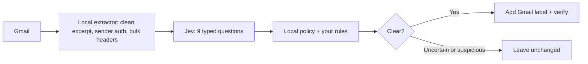

# Inbox Triage

[](https://github.com/shimoverse/inbox-triage/actions/workflows/ci.yml)

**Gmail triage powered by [Jev](https://typesafe.ai/).** Sign in with Google, tell it in your own words what matters, and Inbox Triage adds useful Gmail labels on the schedule you choose: `Triage/Needs You`, `Triage/Updates`, `Triage/For You`, `Triage/Later`, `Topics/Shopping`, and `Triage/Junk` for anything you mark as junk. It never sends, deletes, archives, marks read, or moves mail to Spam. Uncertain mail stays exactly where it was.

## Why Jev

Jev by TypeSafe is a **System One model**. It doesn't write text; it makes fast, typed decisions with calibrated probabilities, which is exactly what triage needs. For every email, Jev answers nine questions in one call:

- Does it need you?
- Is a person waiting on you?
- Is it a service update?
- Is it personally relevant?
- Is it a personalised offer?
- Is it bulk mail?
- Is it deceptive?
- What category is it?
- Is it about shopping?

Fixed local rules turn those answers into at most one attention label, plus a Shopping topic label when that applies. TypeSafe quotes about 0.1 s and a small fraction of a cent per decision, and the dashboard shows the number of Jev decisions and their average latency for every run.

**A Jev key is required, and each user brings their own.** Get one at [console.typesafe.ai](https://console.typesafe.ai/). Without it the app won't sort mail, and it links you there. On the hosted app a user's key is used only for their own mailbox, and the server never falls back to an operator key.



Jev only sees the sender's domain, a subject of up to 200 characters, a cleaned excerpt of up to 1,000 characters, coarse context flags such as "you've emailed this person", and your short summary of what matters. It never sees message IDs, addresses, attachments, earlier mail, or your Google token.

## Two ways to use it

| | **Path 1: the hosted app** | **Path 2: clone and run it yourself** |
|---|---|---|
| For | Anyone; no technical setup | Developers, privacy maximalists, contributors |
| Google setup | None; the app's Google project is already set up | Create your own OAuth client once (about 10 min, guided in the app) |
| You provide | Your Jev key | Your Jev key, plus optionally an OpenRouter key for the notes assistant |
| Where mail is processed | The operator's server | Your own computer |
| Scheduling | Handled by the server | Keep the app running, or add one cron line |

### Path 1: use the hosted app

The hosted app is **free for the first 100 users** (beta). You bring your own Jev key; the code is MIT-licensed, so you can always self-host instead.

1. Open the app, click **Continue with Google** and approve the permission to manage Gmail labels.
2. **Connect Jev.** Paste your Jev key; it's checked with Jev before it's saved. No key? Click **Get a Jev key**.
3. **Tell it what matters.**
   - Tap *Important*, *Can wait* or *Junk* on a few recent emails.
   - Or type freely: *"#1 is my kids' school, always important. I don't care about real estate emails."* Prefer talking? Speak into Open Voice Flow or any voice-to-text app and paste the text.
   - Click **Turn notes into rules**, review the rules, and save.
4. **Pick a timeframe** (last day, 7, 30 or 90 days, optionally preview-only) **and a schedule** (hourly, daily, weekly, or the last day of each month).
5. **Watch the dashboard:** last and next run, Jev decisions and speed, run history, recently labeled mail with links into Gmail, and your rules.

*Operators:* deploying takes one command on a small Linux server (`sudo DOMAIN=… bash deploy/install.sh`; no Docker needed). See [docs/hosting.md](docs/hosting.md), plus [docs/google-cloud-setup.md](docs/google-cloud-setup.md) for the one-time Google Cloud work.

### Path 2: clone and run it yourself

Requirements: Python 3.11+ and [uv](https://docs.astral.sh/uv/). **No other dependencies** (on Windows, just the small `tzdata` package for time zones): Gmail, Google sign-in, Jev and the web app all use Python's standard library, so the app loads in about 25 MB of memory.

```bash
git clone https://github.com/shimoverse/inbox-triage.git
cd inbox-triage
uv sync
cp .env.example .env        # add TYPESAFE_API_KEY (required) and OPENROUTER_API_KEY (optional)
uv run inbox-triage-web     # opens http://127.0.0.1:8765
```

The first screen walks you through connecting Google once: create a Cloud project, enable the Gmail API, click **Publish app**, create a *Desktop app* client, and paste its JSON. [docs/google-cloud-setup.md](docs/google-cloud-setup.md) has the details. After that, it's the same journey as Path 1, entirely on your machine.

To have schedules run without keeping the app open, add one hourly cron line. It follows each account's schedule from the UI:

```cron
0 * * * * cd ~/inbox-triage && uv run inbox-triage --all --due >> ~/.local/state/inbox-triage.log 2>&1
```

Terminal only:

```bash
uv run inbox-triage-auth                                  # connect an account
uv run inbox-triage --account you@example.com --dry-run   # preview, no Gmail changes
uv run inbox-triage --all --days 30                       # backfill 30 days for every account
```

## The optional notes assistant

Jev decides; it doesn't write. Reading your typed notes and proposing rules is a language task, so it goes to **DeepSeek V4.1 Flash via OpenRouter** (`deepseek/deepseek-v4.1-flash`, which you can change with `INBOX_TRIAGE_ASSIST_MODEL`). It runs only when you click **Turn notes into rules**, and you review every rule before it's saved. On the hosted app the operator provides it. When you run it yourself, add `OPENROUTER_API_KEY` or skip it and tag emails instead. It never classifies email.

## How it behaves

- **Your rules come first, within safety limits.**
  - *Important* senders, domains and topics get at least **For You**.
  - *Can wait* ones go to **Later**.
  - *Junk* ones get **Junk** and are never sent to Jev, so they cost nothing. Nothing is deleted, archived or moved to Spam; add a Gmail filter on `Triage/Junk` if you want them out of your inbox.
  - Sender and domain rules only apply to authenticated (DMARC, or SPF plus DKIM) mail, so they can't be spoofed.
  - Suspected phishing is never promoted, and security alerts are never pushed to Later or Junk.
- **Runs work in batches.** Scheduled runs continue from the last checkpoint. Batches are 100 messages, with at most 2,000 per run. Runs overlap by two days to catch delayed mail and skip anything already verified.
- **Context comes from your mailbox.** People you've emailed, threads you joined, and authenticated receipts count. Only account-scoped hashes of these facts are stored, updated through the Gmail History API, and rebuilt automatically if that history expires.
- **Jev failures are contained.** Jev calls retry on 429 and 529 ("overloaded"). A message that repeatedly gets an unusable answer is left unchanged after three tries. If Jev fails repeatedly in a row, the run stops without advancing.
- **Google Workspace admins** can triage many mailboxes with a service account and domain-wide delegation: `uv sync --extra workspace`, then `inbox-triage --service-account key.json --account a@corp.example --account b@corp.example`.

## Privacy and limits

- **Local files per account** (`~/.local/share/inbox-triage/`, 0700/0600):
  - checkpoint, settings and schedule;
  - your rules and notes summary;
  - the account's Jev key (Path 1);
  - run history;
  - a journal of Gmail message IDs and label decisions;
  - hashed relationship evidence.

  Raw messages are never saved; the dashboard fetches subjects live. **Disconnect account** revokes Google access and deletes all of the above. Google tokens, local keys and the web session secret live in `~/.config/inbox-triage/` (0600).
- **Web app security:**
  - listens on 127.0.0.1 unless hosted, and hosting requires HTTPS;
  - signed HttpOnly sessions, and each Google account sees only its own data;
  - a CSRF header check, a Host check, a strict CSP, and PKCE for Google sign-in.
- The app requests only `gmail.modify`, the narrowest Gmail permission that allows adding labels, and never calls the send, delete, archive or mark-read endpoints.
- This is a conservative aid, **not** a guaranteed detector of urgent mail. Jev's documentation doesn't list supported languages, so treat non-English mailboxes as untested.
- Gmail quota: about 65 units per labeled message, against a per-user limit of 6,000 units per minute. Reads are batched and retried with backoff.

## Developers

```bash
uv sync --dev
uv run pytest -q
```

| Module | Role |
|---|---|
| `providers/` | Jev: questions, answer parsing (noul/choice), retries, key check |
| `assistant.py`, `onboarding.py` | Optional notes → rules via OpenRouter |
| `policy.py`, `preferences.py` | Jev answers + your rules → labels |
| `gmail/` | Standard-library Gmail REST client (parallel reads, retries, History API), OAuth with PKCE, message extraction |
| `context.py`, `store.py` | Hashed relationship and purchase facts |
| `runner.py`, `accounts.py`, `config.py` | Triage batches, history, schedules, keys; the CLI |
| `web/` | Web app (stdlib WSGI): Google sign-in, onboarding, dashboard, scheduler |

See [CONTRIBUTING.md](CONTRIBUTING.md), [SECURITY.md](SECURITY.md), and [docs/landscape.md](docs/landscape.md). Use synthetic messages in tests, never real email.

MIT license.
