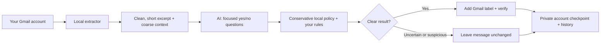

# Inbox Triage

[](https://github.com/shimoverse/inbox-triage/actions/workflows/ci.yml)

**An email sorting assistant that keeps you in control.** Sign in with Google, tell it in your own words what matters, and Inbox Triage adds useful Gmail labels on a schedule you choose. It asks an AI a few focused yes/no questions per email, and fixed local rules decide the label. It does **not** archive, send, delete, mark read, or move messages to Spam. Uncertain mail stays where it is.

## What it feels like

1. **Open the app** and type your email address, then click **Sign in with Google**. Google shows one permission screen. There's nothing else to set up.
2. **Pick an AI.** OpenRouter (one key for OpenAI, Claude, Gemini, Llama and more), OpenAI, Claude, Ollama on your own computer, Jev, or no AI at all.
3. **Tell it what matters.** The app shows your recent emails. Tap *Important* or *Not important* on a few, and/or ramble by typing or dictating: *"#1 is my kids' school, always important. I don't care about real estate emails. Bank alerts matter."* The AI turns your notes into clear rules that you can review and edit.
4. **Choose a timeframe and schedule.** Sort the last day, 7, 30 or 90 days, preview first if you like, and keep it sorted hourly, daily, weekly, or on the last day of every month.
5. **Watch the dashboard.** It shows the last run, the next run, run history, what got labeled (with links into Gmail), and your rules.

In Gmail you'll see `Triage/Needs You`, `Triage/Updates`, `Triage/For You`, `Triage/Later`, and `Topics/Shopping`. Uncertain mail stays exactly where it was.



The AI is only asked questions. It never decides what happens to mail. The local rules in [`policy.py`](src/inbox_triage/policy.py) do that, together with your own rules, so a manipulative email ("ignore previous instructions…") can at worst avoid getting a label.

## Start

Requirements: Python 3.11+ and [uv](https://docs.astral.sh/uv/).

```bash
git clone https://github.com/shimoverse/inbox-triage.git
cd inbox-triage
uv sync --extra anthropic        # the extra is only needed for Claude
uv run inbox-triage-web          # opens http://127.0.0.1:8765
```

Keep the app running (or run it as a login item or service) and scheduled runs happen automatically. Prefer cron? Leave the web app closed and add one hourly line. It respects each account's schedule from the UI:

```cron
0 * * * * cd ~/inbox-triage && uv run inbox-triage --all --due >> ~/.local/state/inbox-triage.log 2>&1
```

### Do users need a Google Cloud project? No, only whoever runs the app does

Google requires every app that reads Gmail to have an OAuth client, and someone has to create it once. **End users never do this.** The person or organisation that runs or distributes Inbox Triage does it one time, and everyone else just clicks *Sign in with Google*:

| How you run it | Who creates the Google client | What users see |
|---|---|---|
| **Packaged build** (maintainer ships one client inside the app) | The maintainer, once | Sign in with Google. Until Google verifies the app, there's an "unverified app" warning and a cap of 100 users in total. |
| **Hosted server** (`inbox-triage-web --public-url https://…`) | The operator, once | Sign in with Google. To serve the public beyond 100 users, the operator completes Google's verification and yearly security assessment. |
| **Self-hosted, just me or my family** | You, once (about 10 minutes, guided in the app) | Sign in with Google |

The app walks whoever runs it through the one-time step: create a project, enable the Gmail API, **Publish app** (otherwise logins expire after 7 days), create a *Desktop app* client, then paste its JSON into the app. See [docs/hosting.md](docs/hosting.md) for packaging and hosting, including Google's verification requirements.

The app requests only `gmail.modify`, the narrowest Gmail permission that allows adding labels. It never calls the send, delete, archive, or mark-read endpoints.

## Choose an AI

| Provider | Key | Notes |
|---|---|---|
| `openrouter` (recommended) | `OPENROUTER_API_KEY` | One key, hundreds of models. Default `openai/gpt-6-luna`; try `anthropic/claude-haiku-4.5` or `google/gemini-3.5-flash-lite`. Requests are routed only to endpoints that support structured output. |
| `openai` | `OPENAI_API_KEY` | Default `gpt-6-luna` with low reasoning effort. A ChatGPT Plus/Pro subscription **doesn't** include API access, so you need an API key from platform.openai.com. |
| `anthropic` | `ANTHROPIC_API_KEY` | Claude with structured output and server-side refusal fallback. Default `claude-opus-5` (strongest, priciest); `claude-haiku-4-5` or `claude-sonnet-5` are cheaper. |
| `ollama` | none | Runs on your computer (`ollama pull llama3.1:8b`), so mail never leaves your machine. `OLLAMA_BASE_URL` points to another server. |
| `jev` | `TYPESAFE_API_KEY` | [Jev](https://typesafe.ai/), a small model built for yes/no judgments. Still the CLI default for compatibility. |
| `rules` | none | No AI. Gmail's own categories and headers, so it only labels obvious promotions. |

Enter keys in the web app (stored in `~/.config/inbox-triage/secrets.json`, mode 0600) or set them as environment variables. Every provider gets the same trimmed input: the sender domain, a subject of up to 200 characters, a cleaned excerpt of up to 1,000 characters, coarse context flags, and your short onboarding summary. It never gets message IDs, addresses, full MIME, attachments, earlier mail, or your OAuth token. Interpreting your onboarding notes needs an LLM provider (anything except `jev` and `rules`); with those two you can still tag emails and add rules by hand.

## Command line

Everything the web app does is also available from the terminal:

```bash
uv run inbox-triage-auth                                   # connect an account (browser consent)
uv run inbox-triage --account you@example.com --dry-run    # preview with the account's saved settings
uv run inbox-triage --all --provider openrouter --days 30  # backfill 30 days for every account
uv run inbox-triage --all --due                            # run whichever schedules are due (for cron)
```

The program checks that `--account` matches the mailbox the token belongs to before it processes anything. The exit code is non-zero if any account failed; `--verbose` includes error messages.

## How it behaves

- Scheduled runs pick up from the last checkpoint (the first run covers the last seven days unless you choose another window). Runs work in batches of 100 and continue until the window is done, capped at 2,000 messages per run. Later runs overlap by two days to catch delayed indexing and skip messages they already verified.
- **Your rules come first,** within safety limits. *Important* senders, domains, or topics get at least **For You**; *not important* ones go to **Later**. Sender and domain rules apply only to authenticated (DMARC/SPF+DKIM) mail, so they can't be spoofed. Suspected phishing is never promoted, and security alerts are never pushed to Later.
- Context comes from your mailbox. People you have emailed and threads you took part in count as known relationships. Authenticated (DMARC-pass) order and receipt senders count as recent purchases. It stores only account-scoped hashes of these facts, locally, and updates them incrementally through the Gmail History API. If Gmail's history window expires (roughly a week without a run), it rebuilds the context automatically.
- If the model returns an unusable answer, that message is retried on the next two runs and then left unchanged. Other mail keeps flowing. If the provider fails repeatedly, the run stops without advancing.
- Mail the model flags as possibly deceptive **never** gets an attention label.
- Optional priorities live in the account's private state folder as `priorities.json`, for example `{"priorities":[{"topic":"renewal","terms":["renewal"],"expires":"2027-01-01"}]}`. Only matching, unexpired topic names are sent to the model.

### Google Workspace: many mailboxes, one key

Workspace admins can triage many users without per-user consent, using a service account with [domain-wide delegation](https://developers.google.com/identity/protocols/oauth2/service-account#delegatingauthority):

1. Create a service account and a JSON key.
2. In the Admin console (Security → API controls → Domain-wide delegation), authorize its client ID for `https://www.googleapis.com/auth/gmail.modify`.
3. Run: `uv run inbox-triage --service-account key.json --account alice@corp.example --account bob@corp.example`

Delegation only works for Workspace domains, not consumer gmail.com accounts. Treat the key as highly sensitive: it can read every mailbox you delegate.

## Privacy and limits

- **Local files per account:** a checkpoint, settings, your rules and onboarding summary, run history, a journal of Gmail message IDs and label decisions (compacted after about 95 days), and a SQLite store of hashed relationship evidence. The default location is `~/.local/share/inbox-triage/`, one opaque directory per account, with 0700/0600 permissions. OAuth tokens, API keys, and the web session secret live in `~/.config/inbox-triage/` (0600). Raw messages are never saved; the dashboard fetches subjects live from Gmail. Exclude these directories from shared cloud sync and backups.
- **Onboarding notes** go once to the AI you picked, to turn them into rules; only the rules and a short summary are kept. Dictation uses your browser's speech recognition, and in Chrome that sends audio to Google.
- **The web app** listens only on this computer (127.0.0.1) by default. It uses signed, HttpOnly session cookies, a CSRF header check, a Host check against DNS rebinding, a strict Content-Security-Policy, and PKCE for Google sign-in. Each Google account can only see its own data.
- Only received mail is considered; Sent, Drafts, Spam, and Trash are excluded. A message that is already read or archived can still be labeled, and labels never change its location or read status.
- Labels are created on the first live run, and only these five are managed. There is no automatic Spam routing, archiving, sending, deleting, unsubscribing, or learning from read state.
- This is a conservative aid, **not** a guaranteed detector of urgent mail. Don't rely on it as your only way to notice security, medical, financial, or time-sensitive messages. Quality varies by model, language, and mailbox.
- Gmail API quota: each labeled message costs about 65 [quota units](https://developers.google.com/workspace/gmail/api/reference/quota) (one full read, two label readbacks, one modify), and there is a one-time bootstrap of up to 500 metadata reads. The per-user limit is 6,000 units per minute. Reads are batched, and rate-limit responses are retried with backoff.

## Developers

```bash
uv sync --dev --extra anthropic
uv run pytest -q
uv run inbox-triage --help
```

| Module | Role |
|---|---|
| `gmail/client.py` | Gmail access: batching, retries, History API, OAuth token and service-account credentials |
| `gmail/extract.py` | MIME → cleaned excerpt plus authentication and bulk signals |
| `context.py`, `store.py` | Hashed relationship and purchase facts learned from Sent mail and history |
| `providers/` | `base.py` (questions and answer parsing), `jev.py`, `llm.py` (Claude; OpenAI, OpenRouter, Ollama presets), `rules.py` |
| `policy.py` | Signals → at most one attention label and a topic label |
| `runner.py` | One triage batch: locking, journal, label apply and readback; the CLI |
| `accounts.py`, `config.py` | Per-account settings, schedules, run history; provider and key resolution |
| `preferences.py`, `onboarding.py` | Personal rules, and turning a ramble into rules |
| `web/` | The web app (stdlib WSGI): Google sign-in with PKCE, JSON API, scheduler, static UI |

See [CONTRIBUTING.md](CONTRIBUTING.md), [SECURITY.md](SECURITY.md), and [docs/landscape.md](docs/landscape.md) for related projects and the roadmap. Use synthetic messages in tests, never real email exports.

MIT license.
