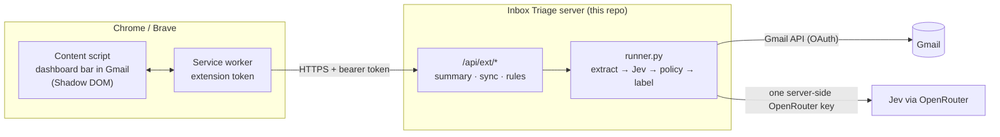

# Plan: Inbox Triage for Chrome and Brave

*Proposal, September 2026. Nothing here is built yet.*

The goal is for a person to open Gmail, see a live Inbox Triage dashboard across the top of the page, and have new mail labeled automatically. They connect Google once, and nothing else stands between them and a sorted inbox: no Jev key, no Google Cloud setup, and no separate website to learn.

## Decisions so far

- **Gmail only** for the MVP.
- **Google sign-in stays.** It takes one consent screen, and it lets labels show up everywhere, including the Gmail phone app.
- **No key from users during the beta.** Jev runs on the server through the founder's OpenRouter key.
- **Same repository, new `extension/` folder.** The extension is a thin front end for this server. Keeping both in one repo means one pull request can change an API and its only caller together. The label names, privacy promises and CI also stay in one place.

## What the person sees

1. **Install** Inbox Triage from the Chrome Web Store. Brave installs Chrome Web Store extensions too.
2. **Open Gmail.** A slim bar appears above the inbox: *Sort my inbox automatically*, with a **Connect Gmail** button.
3. **Connect Gmail.** A Google window opens and they approve Gmail access. Google's wording is broad, but the app only adds labels. There is no key to paste and no settings page to visit.
4. **First results within about 30 seconds.** The server labels the last 7 days and the bar fills in live as it goes.
5. **After that it runs by itself.** While Gmail is open, new mail is labeled within about a minute; the rest of the time it runs on a schedule (hourly by default). The labels are ordinary Gmail labels, so they also appear on the phone.
6. **Teaching comes after the first results.** Once the bar has shown results, it offers *Teach it: mark a few emails Important, Can wait or Junk*. This is the same rules system as today, moved after the first result instead of before it.

The bar, collapsed to one line, can be expanded:

```
┌ Inbox Triage ────────────────────────────────────────── Sorted 95 in 11 s · live ● ┐
│ Needs You 4 ▇▇  Updates 12 ▇▇▇▇  For You 7 ▇▇▇  Later 63 ▇▇▇▇▇▇▇▇▇▇▇▇  Junk 9 ▇▇ │
│ Last 7 days ▁▂▅▃▂▇▄   Needs You: "Can you sign the lease by Friday?" – Dana        │
└────────────────────────────────────────────────────────────── Teach it · Settings ┘
```

- **Clicking a bucket opens that Gmail label** (for example `#label/Triage%2FNeeds+You`), so Gmail itself shows the filtered list. The extension never has to redraw Gmail's email list.
- **Colors match everywhere.** The same bucket colors are set on the Gmail labels (via the Gmail API `color` field), so the bar, the label chips on each row and the phone app all agree.

**Compared with today:** the hosted app asks for three setup steps (Connect Jev → What matters → Schedule) before any result. This plan puts Google consent alone before the first result.

## How it works



**The extension draws the dashboard; the server does all the work.** The extension never holds a Google token or an AI key, and it doesn't read email. It shows the counts and recent decisions the server already records, and it tells the server when to look for new mail. Doing the work on the server is right for four reasons:

- **An AI key can't live in an extension.** Anyone can unzip an extension package and read the key; see *Keys* below.
- **The server already does the hard parts.** Google OAuth with PKCE, batched Gmail reads, rate-limit pauses, checkpoints, dedupe, rules, schedules, run history, and the tested Python policy. None of it has to be ported to JavaScript.
- **Labels keep coming when the laptop is closed**, and they show up on the phone.
- **One policy.** Safety rules such as "phishing is never promoted" and "security alerts are never buried" stay in `policy.py`, in one place.

### Pieces to build

| Piece | Where | What it does |
|---|---|---|
| Dashboard bar | `extension/` content script | Inserted above Gmail's main area inside a Shadow DOM so Gmail's CSS can't break it. Charts are small inline SVG (no chart library; Chrome Web Store rules forbid loading remote code). |
| Sign-in bridge | `extension/` service worker + `web/oauth.py` | `chrome.identity.launchWebAuthFlow` opens our server's existing Google sign-in. The server then redirects to `https://<extension-id>.chromiumapp.org/` with a one-time code, which the extension swaps for a revocable extension token. |
| Extension API | `web/app.py` | `GET /api/ext/summary` (counts per label per day, last run, recent decisions), `POST /api/ext/sync` (start an incremental run; at most one a minute per account), `GET`/`PUT /api/ext/rules`. Bearer-token auth, CORS limited to the extension's origin. |
| Near-real-time runs | extension + server | **Phase 1:** when Gmail's inbox changes and the tab is visible, the extension asks the server to sync. The runner already continues from its checkpoint and skips mail it has verified, so a sync costs little when nothing is new. **Phase 2:** Gmail push notifications (`users.watch` + Cloud Pub/Sub) label mail even when no tab is open. |
| Label colors | `runner.py:ensure_labels` | Create labels with Gmail's `color` field; fix the colors on existing labels once. |

## Jev through OpenRouter: removing the key step

**The belief is mostly right. It isn't free, but it is extremely cheap.** OpenRouter now sells Jev directly, and nobody needs a TypeSafe account (checked against OpenRouter's live model list on 2026-09-27):

- **Models:** `typesafe/jev-1.13`, or the alias `~typesafe/jev-latest`. Context is 32k tokens.
- **Price:** $0.042 per million *input* tokens. Output is free.
- **Endpoint:** `POST https://openrouter.ai/api/v1/systemone` accepts TypeSafe's request shape and is authenticated with an OpenRouter key.
- **Per email:** Inbox Triage sends about 1,500 tokens (the nine questions plus a trimmed excerpt). That works out to about **$0.00006 per email**, or roughly 16,000 emails per dollar.
- **Why not direct:** TypeSafe reportedly paused new direct signups on 2026-09-22 (secondary sources only). OpenRouter avoids that dependency.

**100 beta users**, each with a 1,000-email first backfill plus 60 new emails a day:

| | Emails | Jev cost |
|---|---|---|
| First month | 280,000 | about $18 |
| Each month after | 180,000 | about $11 |

Add 5.5% for OpenRouter's fee on credit purchases. A $50 monthly cap leaves more than twice the headroom.

**"Free" OpenRouter models are the wrong tool here**, for two reasons:

- **Rate limits.** The limits (20 requests a minute; 50 a day, or 1,000 with $10 of credit) apply to the whole account, so all 100 users would share them.
- **Privacy.** Many free endpoints may train on prompts or publish them. Sending someone's email there would break Google's user-data policy.

### The server change

The existing Jev client posts to `{base}/v1/systemone`, so pointing it at OpenRouter is configuration plus one policy switch:

1. **Point Jev at OpenRouter.** Set `TYPESAFE_API_BASE=https://openrouter.ai/api` and `INBOX_TRIAGE_JEV_MODEL=~typesafe/jev-latest`. Confirm the response shape with one real call before relying on it.
2. **Add a sponsored mode.** For example, `INBOX_TRIAGE_SPONSORED_JEV=1`: when it is set, a hosted server may use the operator's key for accounts that haven't connected their own. Today the hosted server deliberately refuses to (`config.jev_settings(allow_machine_key=False)`). That rule was there so the operator could never pay by accident; sponsoring is a deliberate choice, so it gets its own switch and limits. The "Connect Jev" step disappears for sponsored users; bringing your own key stays available for later.
3. **Guard the budget.**
   - Use an OpenRouter key made for this server with a USD `limit` and a monthly reset. It acts as a circuit breaker.
   - Per account, cap usage at about 2,000 emails for the backfill and 300 a day after that. The runner already counts Jev calls per run.
   - Turn on OpenRouter's account-wide zero data retention. Jev's endpoint is on OpenRouter's zero-retention list.
   - When a cap is hit, the account pauses with a clear message instead of failing.
4. **Update the docs.** Update the README, `docs/hosting.md` and the privacy page: name OpenRouter as a processor and describe what it receives (the same trimmed evidence as today).

This keeps "every per-email decision is a Jev answer" (CONTRIBUTING.md) intact; only the route to Jev changes. Phase 0 below ships this to the existing website before the extension exists, so the website loses its Jev step right away.

### Keys never go in the extension

A Chrome extension is a zip file, and its code sits in plain text on disk. Extensions have leaked hard-coded cloud keys in the wild (Symantec, June 2025), and a fake ChatGPT extension stole 459 OpenAI keys. The only safe pattern is the one above: the key stays on the server, the extension holds a revocable per-user token, and the server enforces quotas.

## Google sign-in: what it costs

`gmail.modify` is a *restricted* Gmail scope, and it is the narrowest one that can add labels to messages. (`gmail.labels` can only create and rename labels.) Until Google verifies the app:

- **Warning screen.** Users see *"Google hasn't verified this app"* and must click *Advanced → Continue*. The bar should say so before it opens Google, so the warning isn't a surprise.
- **100-user lifetime cap.** The app is capped at **100 users in total, for the life of the Google project**, and the cap can't be reset. This is where "free for the first 100 users" comes from.
  - Today's beta limit (`INBOX_TRIAGE_MAX_ACCOUNTS`) is checked *after* Google consent. Anyone turned away has already used a slot.
  - Check the limit *before* sending someone to Google.
  - Set it to about 90, to allow for test accounts that have already signed in.
- **Beyond 100 users: restricted-scope verification.**
  - A verified domain, a privacy policy and a demo video.
  - A yearly third-party **CASA** security assessment, usually Tier 2 for Gmail apps.
  - Tier 2 costs about $540–$1,800 a year at the cheapest lab. Budget about two months end to end.
  - Every AI inbox product checked (Shortwave, SaneBox, Fyxer and others) went through this.
- **Google's AI rule.** Google's user-data policy lets the app send email excerpts to an AI provider only as part of the feature the user asked for, and never to train a general model. Jev over zero-retention OpenRouter fits. Free models that train on prompts do not.
- **Testing mode is no shortcut.** Leaving the app in *Testing* also caps it at 100 listed users, and every token expires after 7 days.

## Chrome Web Store

- **Publish the beta as *Unlisted*.** Only people with the link can find it, but Google still reviews it like any other listing. Submit early: extensions that can read a site as sensitive as Gmail get a closer look.
- **Ask for every permission in version 1.** The permissions are `storage`, `identity`, and host access to `mail.google.com` and our API domain. If a later update adds a permission that shows a warning, Chrome disables the extension until each user accepts it.
- **Install warning.** Users will see *"Read and change your data on mail.google.com"*. The listing and the bar should say plainly that the extension only draws a dashboard, and that labeling happens on the server with the Google permission they approve separately.
- **The store's 2026 rules.** From 2026-08-01 the store enforces two things. All data collected must be strictly necessary for the extension's single purpose, and it must be disclosed prominently. Fill in the privacy practices form and link the privacy page. The extension itself collects nothing beyond its sign-in token.
- **Brave** installs extensions from the Chrome Web Store. `launchWebAuthFlow` is used for sign-in because Chrome's other sign-in call, `getAuthToken`, relies on Chrome's own Google-account sign-in, which Brave doesn't have.

## Phases

**Phase 0: the website loses its key step (about 3 days).** This ships before any extension work.

- Jev through OpenRouter, sponsored mode, budget caps and zero retention, as described above.
- A beta check before Google consent, with the limit set to about 90.
- Gmail label colors.
- The onboarding skips "Connect Jev" for sponsored accounts.
- **Done when:** a new user goes from *Continue with Google* to a labeled inbox without typing anything.

**Phase 1: the extension MVP (about 2 weeks).**

- `extension/`: Manifest V3 in plain JavaScript with no build step and no dependencies, matching the web app. CI adds `node --check` for its files.
- Sign-in bridge, `/api/ext/*`, the dashboard bar, and sync when the inbox changes.
- Unlisted store listing; tested in Chrome and Brave.
- **Done when:** 10 friendly users install it and reach a labeled inbox in under 2 minutes (median) without help.

**Phase 2: beta polish (about 2 weeks).**

- **Teach it** from the bar: Important, Can wait and Junk buttons on the recent decisions the server already lists. No reading of Gmail's page is needed.
- **Undo all.** Remove every Inbox Triage label the journal says it added. This is still label-only.
- **Learn from corrections.** When someone removes or changes one of our labels in Gmail (History API `labelRemoved`), offer a rule. This is roadmap item 2 in [landscape.md](landscape.md).
- **Gmail push notifications** (`users.watch` + Pub/Sub), so mail is labeled even when no Gmail tab is open.

**Phase 3: after the beta.**

- CASA verification, to lift the 100-user cap.
- Pricing: a paid plan, or users bring their own OpenRouter key. OpenRouter can create capped sub-keys for each user.
- A public store listing.

## What to measure

| Metric | Beta target |
|---|---|
| Installed → Gmail connected | ≥ 70% |
| Connected → first labels visible | ≥ 95%, median under 60 s |
| Active on 3 of the first 7 days (bar opened or a bucket clicked) | ≥ 50% |
| Our labels removed or changed by the user | < 5% |
| Jev cost per active user per month | < $0.30 |
| Support requests per 10 users | < 1 |

The server already records runs, Jev call counts and latency per account. The extension adds nothing beyond those counts: no analytics SDK and no mail content.

## Risks

| Risk | Mitigation |
|---|---|
| A Gmail page change breaks where the bar is inserted | Only the bar breaks; labeling runs on the server and keeps working. Anchor to one container, fall back to a small floating button, and ship fixes quickly. |
| The unverified-app warning scares people off | Warn before opening Google. Keep the beta invite-led, with a personal note. |
| Someone runs up the sponsored AI bill | A capped OpenRouter key, per-account limits, and an endpoint that only triages the signed-in user's mail. It is never a general AI proxy. |
| OpenRouter changes Jev's price or availability | The base URL and model are settings, so the app can switch back to TypeSafe directly. |
| Store review is slow or rejects the extension | Minimal permissions, a clear single purpose, a privacy page, and an early submission. |
| One small server gets busy with minute-by-minute syncs | Runs skip verified mail and allow one sync a minute per account. Watch memory and move up a VM size if needed. |

## Parked: Chrome's built-in AI

Chrome can download a small Google model (Gemini Nano) onto the user's own computer, and extensions can use it through the Prompt API (Chrome 138 and later).

- **What it would give:** sorting with no API key, no cost and no email leaving the laptop.
- **Why it's parked:**
  - It works only in desktop Chrome, not in Brave.
  - It needs a fairly powerful machine: 16 GB of RAM or a graphics card with more than 4 GB, plus 22 GB of free disk.
  - It downloads several gigabytes the first time.
  - It would be a second classifier to keep as safe as Jev.
- **Why it's not needed:** Jev through OpenRouter costs about a cent per 160 emails and keeps the labels on the server where the phone can see them.
- **When to revisit:** a "fully private mode" for power users could use it later.

## Open questions

1. **First run: label right away, or preview first?** Today's setup defaults to a preview. Labeling right away gives the "it just works" moment, and labels can be removed. Recommendation: label right away.
2. **Budget:** is a $50 monthly cap on the sponsored OpenRouter key acceptable?
3. **Who gets in:** first come, first served up to about 90, or invite codes?
4. **Store name:** "Inbox Triage", the same as the app?

## Sources

- **OpenRouter:**
  - Jev on OpenRouter: <https://openrouter.ai/docs/guides/community/jev>, plus the live model list at <https://openrouter.ai/api/v1/models>, checked 2026-09-27.
  - Limits: <https://openrouter.ai/docs/api/reference/limits>
  - Zero data retention: <https://openrouter.ai/docs/guides/features/zdr>
  - Capped keys: <https://openrouter.ai/docs/guides/overview/auth/provisioning-api-keys>
- **TypeSafe signup pause** (secondary source, unverified): <https://jevainews.com/news/typesafe-signups-paused/>
- **Google:**
  - Gmail scopes: <https://developers.google.com/workspace/gmail/api/auth/scopes>
  - Unverified apps: <https://support.google.com/cloud/answer/7454865>
  - User cap: <https://support.google.com/cloud/answer/13463817>
  - Restricted-scope verification: <https://developers.google.com/identity/protocols/oauth2/production-readiness/restricted-scope-verification>
  - User-data policy: <https://developers.google.com/terms/api-services-user-data-policy>
  - Workspace AI rule: <https://developers.google.com/workspace/workspace-api-user-data-developer-policy>
- **CASA pricing:** <https://deepstrike.io/blog/google-casa-security-assessment-2025>
- **Chrome Web Store:**
  - 2026 policy updates: <https://developer.chrome.com/blog/cws-policy-updates-2026>
  - Limited Use: <https://developer.chrome.com/docs/webstore/program-policies/limited-use>
  - Permission warnings: <https://developer.chrome.com/docs/extensions/develop/concepts/permission-warnings>
- **Keys leaked from extensions:** <https://www.security.com/threat-intelligence/chrome-extension-credentials>
- **Chrome's built-in AI:**
  - Prompt API: <https://developer.chrome.com/docs/ai/prompt-api>
  - Brave doesn't ship the model: <https://github.com/brave/brave-browser/issues/40599>
